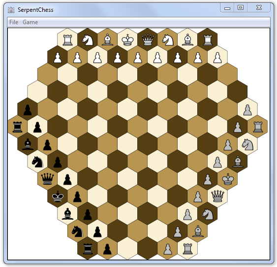

# Serpent Chess

Three player chess game written in Java.

It was implemented as part of the "Clean Code Development" team project in 2013/2014 at the Otto-von-Guericke University Magdeburg.

# Requirements

You need at least Java 7 to run this application.

# License

Serpent Chess is licensed under the [Apache License, Version 2.0.](LICENSE)

Some icons by [Yusuke Kamiyamane](http://p.yusukekamiyamane.com/). All rights reserved.